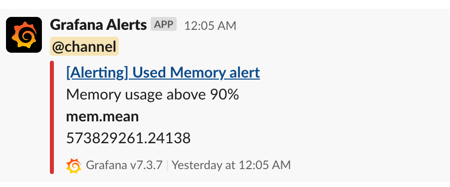

##

# Proactive monitoring using alerts
Earlier we discussed different ways to collect key metric data points
from a service and its underlying infrastructure. This data gives us a
better understanding of how the service is performing. One of the main
objectives of monitoring is to detect any service degradations early
(reduce Mean Time To Detect) and notify stakeholders so that the issues
are either avoided or can be fixed early, thus reducing Mean Time To
Recover (MTTR). For example, if you are notified when resource usage by
a service exceeds 90 percent, you can take preventive measures to avoid
any service breakdown due to a shortage of resources. On the other hand,
when a service goes down due to an issue, early detection and
notification of such incidents can help you quickly fix the issue.

 
 Figure 8: An alert notification received on Slack 

Today most of the monitoring services available provide a mechanism to
set up alerts on one or a combination of metrics to actively monitor the
service health. These alerts have a set of defined rules or conditions,
and when the rule is broken, you are notified. These rules can be as
simple as notifying when the metric value exceeds n to as complex as a
week over week (WoW) comparison of standard deviation over a period of
time. Monitoring tools notify you about an active alert, and most of
these tools support instant messaging (IM) platforms, SMS, email, or
phone calls. Figure 8 shows a sample alert notification received on
Slack for memory usage exceeding 90 percent of total RAM space on the
host.
