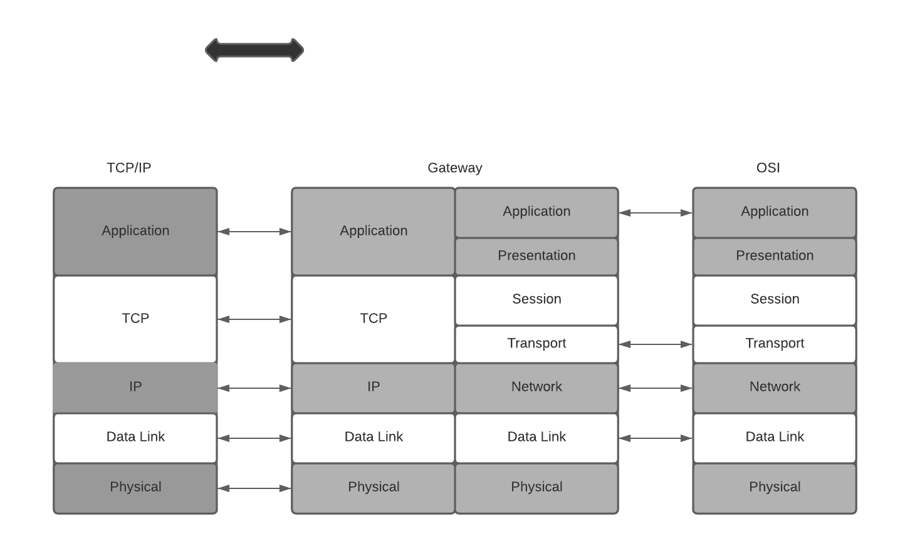
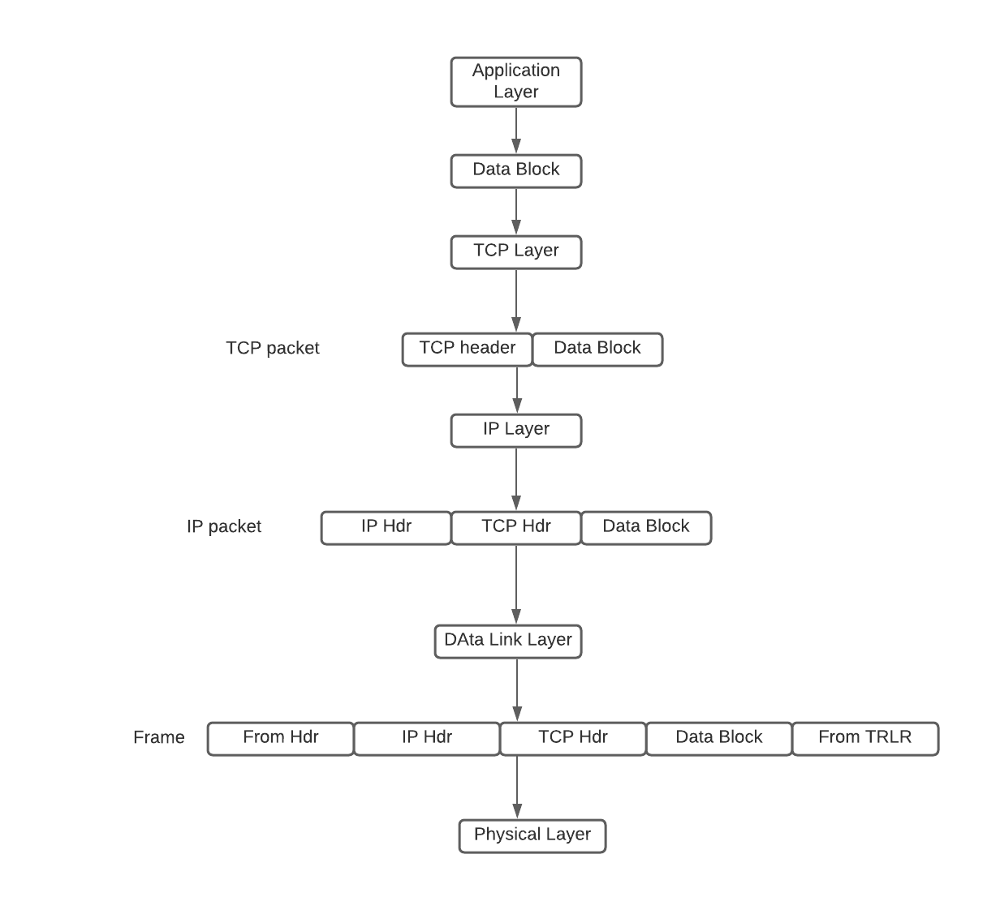
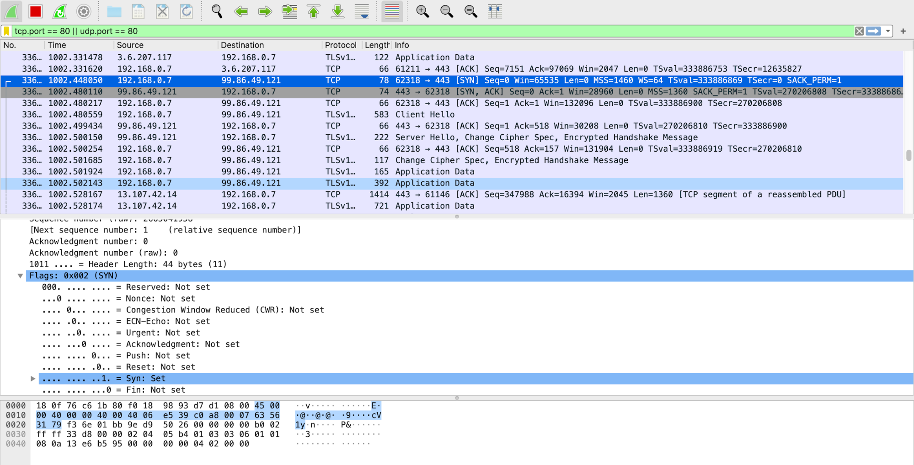
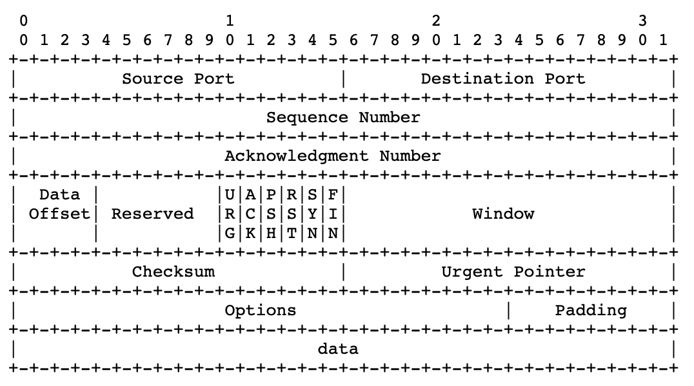
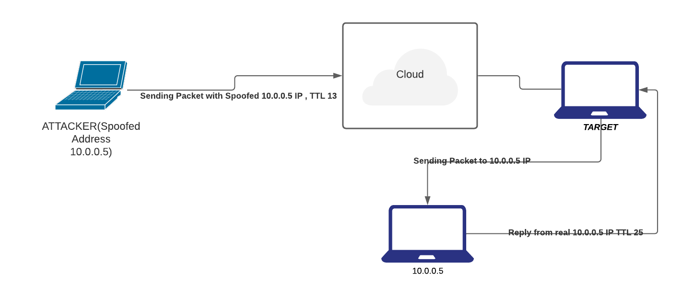
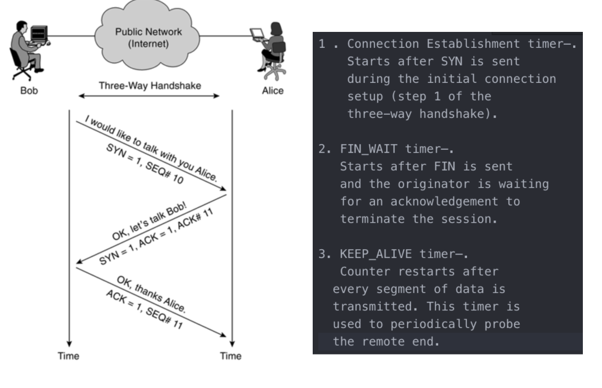
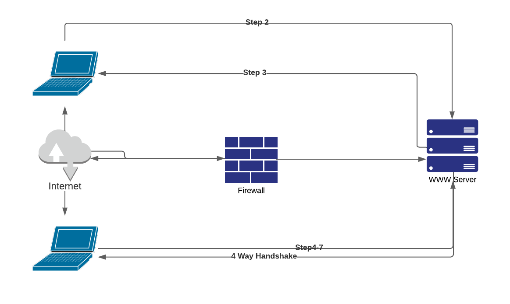

# Part II : Network Security

## Introduction

- TCP/IP is the dominant networking technology today. It is a five-layer architecture. These layers are, from top to bottom, the application layer, the transport layer (TCP), the network layer (IP), the data-link layer, and the physical layer. In addition to TCP/IP, there also are other networking technologies. For convenience, we use the OSI network model to represent non-TCP/IP network technologies. Different networks are interconnected using gateways. A gateway can be placed at any layer.
- The OSI model is a seven-layer architecture. The OSI architecture is similar to the TCP/IP architecture, except that the OSI model specifies two additional layers between the application layer and the transport layer in the TCP/IP architecture. These two layers are the presentation layer and the session layer. Figure 5.1 shows the relation between the TCP/IP layers and the OSI layers. The application layer in TCP/IP corresponds to the application layer and the presentation layer in OSI. The transport layer in TCP/IP corresponds to the session layer and the transport layer in OSI. The remaining three layers in the TCP/IP architecture are one-to-one correspondent to the remaining three layers in the OSI model.

    
    Correspondence between layers of the TCP/IP architecture and the OSI model. Also shown are placements of cryptographic algorithms in network layers, where the dotted arrows indicate actual communications of cryptographic algorithms

The functionalities of OSI layers are briefly described as follows:

1. The application layer serves as an interface between applications and network programs. It supports application programs and end-user processing. Common application-layer programs include remote logins, file transfer, email, and Web browsing.
2. The presentation layer is responsible for dealing with data that is formed differently. This protocol layer allows application-layer programs residing on different sides of a communication channel with different platforms to understand each other's data formats regardless of how they are presented.
3. The session layer is responsible for creating, managing, and closing a communication connection.
4. The transport layer is responsible for providing reliable connections, such as packet sequencing, traffic control, and congestion control.
5. The network layer is responsible for routing device-independent data packets from the current hop to the next hop.
6. The data-link layer is responsible for encapsulating device-independent data packets into device-dependent data frames. It has two sublayers: logical link control and media access control.
7. The physical layer is responsible for transmitting device-dependent frames through some physical media.

- Starting from the application layer, data generated from an application program is passed down layer-by-layer to the physical layer. Data from the previous layer is enclosed in a new envelope at the current layer, where the data from the previous layer is also just an envelope containing the data from the layer before it. This is similar to enclosing a smaller envelope in a larger one. The envelope added at each layer contains sufficient information for handling the packet. Application-layer data are divided into blocks small enough to be encapsulated in an envelope at the next layer.
- Application data blocks are “dressed up” in the TCP/IP architecture according to the following basic steps. At the sending side, an application data block is encapsulated in a TCP packet when it is passed down to the TCP layer. In other words, a TCP packet consists of a header and a payload, where the header corresponds to the TCP envelope and the payload is the application data block. Likewise, the TCP packet will be encapsulated in an IP packet when it is passed down to the IP layer. An IP packet consists of a header and a payload, which is the TCP packet passed down from the TCP layer. The IP packet will be encapsulated in a device-dependent frame (e.g., an Ethernet frame) when it is passed down to the data-link layer. A frame has a header, and it may also have a trailer. For example, in addition to having a header, an Ethernet frame also has a 32-bit cyclic redundancy check (CRC) trailer. When it is passed down to the physical layer, a frame will be transformed to a sequence of media signals for transmission

    
        Flow Diagram of a Packet Generation

- At the destination side, the medium signals are converted by the physical layer into a frame, which is passed up to the data-link layer. The data-link layer passes the frame payload (i.e., the IP packet encapsulated in the frame) up to the IP layer. The IP layer passes the IP payload, namely, the TCP packet encapsulated in the IP packet, up to the TCP layer. The TCP layer passes the TCP payload, namely, the application data block, up to the application layer. When a packet arrives at a router, it only goes up to the IP layer, where certain fields in the IP header are modified (e.g., the value of TTL is decreased by 1). This modified packet is then passed back down layer-by-layer to the physical layer for further transmission.

### Public Key Infrastructure

- To deploy cryptographic algorithms in network applications, we need a way to distribute secret keys using open networks. Public-key cryptography is the best way to distribute these secret keys. In order to use public-key cryptography, we need to build a public-key infrastructure (PKI) to support and manage public-key certificates and certificate authority (CA) networks. In particular, PKIs are set up to perform the following functions:
  - Determine the legitimacy of users before issuing public-key certificates to them.
  - Issue public-key certificates upon user requests.
  - Extend public-key certificates valid time upon user requests.
  - Revoke public-key certificates upon users' requests or when the corresponding private keys are compromised.
  - Store and manage public-key certificates.
  - Prevent digital signature signers from denying their signatures.
  - Support CA networks to allow different CAs to authenticate public-key certificates issued by other CAs.
  - X.509: <https://certificatedecoder.dev/?gclid=EAIaIQobChMI0M731O6G6gIVVSQrCh04bQaAEAAYASAAEgKRkPD_BwE>

### IPsec: A Security Protocol at the Network Layer

- IPsec is a major security protocol at the network layer
- IPsec provides a potent platform for constructing virtual private networks (VPN). VPNs are private networks overlayed on public networks.
- The purpose of deploying cryptographic algorithms at the network layer is to encrypt or authenticate IP packets (either just the payloads or the whole packets).
- IPsec also specifies how to exchange keys. Thus, IPsec consists of authentication protocols, encryption protocols, and key exchange protocols. They are referred to, respectively, as authentication header (AH), encapsulating security payload (ESP), and Internet key exchange (IKE).

### PGP & S/MIME : Email Security

- There are a number of security protocols at the application layer. The most used of these protocols are email security protocols namely PGP and S/MIME.
- SMTP (“Simple Mail Transfer Protocol”) is used for sending and delivering from a client to a server via port 25: it’s the outgoing server. On the contrary, POP (“Post Office Protocol”) allows the user to pick up the message and download it into his own inbox: it’s the incoming server. The latest version of the Post Office Protocol is named POP3, and it’s been used since 1996; it uses port 110

PGP

- PGP implements all major cryptographic algorithms, the ZIP compression algorithm, and the Base64 encoding algorithm.
- It can be used to authenticate a message, encrypt a message, or both. PGP follows the following general process: authentication, ZIP compression, encryption, and Base64 encoding.
- The Base64 encoding procedure makes the message ready for SMTP transmission

GPG (GnuPG)

- GnuPG is another free encryption standard that companies may use that is based on OpenPGP.
- GnuPG serves as a replacement for Symantec’s PGP.
- The main difference is the supported algorithms. However, GnuPG plays nice with PGP by design. Because GnuPG is open, some businesses would prefer the technical support and the user interface that comes with Symantec’s PGP.
- It is important to note that there are some nuances between compatibility of GnuPG and PGP, such as the compatibility between certain algorithms, but in most applications such as email, there are workarounds. One such algorithm is the IDEA Module which isn’t included in GnuPG out of the box due to patent issues.

S/MIME

- SMTP can only handle 7-bit ASCII text (You can use UTF-8 extensions to alleviate this limitations, ) messages. While POP can handle other content types besides 7-bit ASCII, POP may, under a common default setting, download all the messages stored in the mail server to the user's local computer. After that, if POP removes these messages from the mail server. This makes it difficult for the user to read his messages from multiple computers.
- The Multipurpose Internet Mail Extension protocol (MIME) was designed to support sending and receiving email messages in various formats, including nontext files generated by word processors, graphics files, sound files, and video clips. Moreover, MIME allows a single message to include mixed types of data in any combination of these formats.
- The Internet Mail Access Protocol (IMAP), operated on TCP port 143(only for non-encrypted), stores (Configurable on both server & client just like PoP) incoming email messages in the mail server until the user deletes them deliberately. This allows the user to access his mailbox from multiple machines and download messages to a local machine without deleting it from the mailbox in the mail server.

SSL/TLS

- SSL uses a PKI to decide if a server’s public key is trustworthy by requiring servers to use a security certificate signed by a trusted CA.
- When Netscape Navigator 1.0 was released, it trusted a single CA operated by the RSA Data Security corporation.
- The server’s public RSA keys were used to be stored in the security certificate, which can then be used by the browser to establish a secure communication channel. The security certificates we use today still rely on the same standard (named X.509) that Netscape Navigator 1.0 used back then.
- Netscape’s intent was to train users(though this didn’t work out later) to differentiate secure communications from insecure ones, so they put a lock icon next to the address bar. When the lock is open, the communication is insecure. A closed lock means communication has been secured with SSL, which required the server to provide a signed certificate. You’re obviously familiar with this icon as it’s been in every browser ever since. The engineers at Netscape truly created a standard for secure internet communications.
- A year after releasing SSL 2.0, Netscape fixed several security issues and released SSL 3.0, a protocol that, albeit being officially deprecated since June 2015, remains in use in certain parts of the world more than 20 years after its introduction. In an effort to standardize SSL, the Internet Engineering Task Force (IETF) created a slightly modified SSL 3.0 and, in 1999, unveiled it as Transport Layer Security (TLS) 1.0. The name change between SSL and TLS continues to confuse people today. Officially, TLS is the new SSL, but in practice, people use SSL and TLS interchangeably to talk about any version of the protocol.

- Must See:
  - <https://tls.ulfheim.net/>
  - <https://davidwong.fr/tls13/>

## Network  Perimeter Security

Let us see how we keep a check on the perimeter i.e the edges, the first layer of protection

### General Firewall Framework

- Firewalls are needed because encryption algorithms cannot effectively stop malicious packets from getting into an edge network.
- This is because IP packets, regardless of whether they are encrypted, can always be forwarded into an edge network.
- Firewalls that were developed in the 1990s are important instruments to help restrict network access. A firewall may be a hardware device, a software package, or a combination of both.
- Packets flowing into the internal network from the outside should be evaluated before they are allowed to enter. One of the critical elements of a firewall is its ability to examine packets without imposing a negative impact on communication speed while providing security protections for the internal network.
- The packet inspection that is carried out by firewalls can be done using several different methods. On the basis of the particular method used by the firewall, it can be characterized as either a packet filter, circuit gateway, application gateway, or dynamic packet filter.

### Packet Filters

- It inspects ingress packets coming to an internal network from outside and inspects egress packets going outside from an internal network
- Packing filtering only inspects IP headers and TCP headers, not the payloads generated at the application layer
- A packet filtering firewall uses a set of rules to determine whether a packet should be allowed or denied to pass through.
- 2 types:
  - Stateless
    - It treats each packet as an independent object, and it does not keep track of any previously processed packets. In other words, stateless filtering inspects a packet when it arrives and makes a decision without leaving any record of the packet being inspected.

  - Stateful
    - Stateful filtering, also referred to as connection-state filtering, keeps track of connections between an internal host and an external host. A connection state (or state, for short) indicates whether it is a TCP connection or a UDP connection and whether the connection is established.

### Circuit Gateways

- Circuit gateways, also referred to as circuit-level gateways, are typically operated at the transportation layer
- They evaluate the information of the IP addresses and the port numbers contained in TCP (or UDP) headers and use it to determine whether to allow or to disallow an internal host and an external host to establish a connection.
- It is common practice to combine packet filters and circuit gateways to form a dynamic packet filter (DPF).

### Application Gateways(ALG)

- Aka PROXY Servers
- An Application Level Gateway (ALG) acts like a proxy for internal hosts, processing service requests from external clients.
- An ALG performs deep inspections on each IP packet (ingress or egress).
- In particular, an ALG inspects application program formats contained in the packet (e.g., MIME format or SQL format) and examines whether its payload is permitted.
  - Thus, an ALG may be able to detect a computer virus contained in the payload. Because an ALG inspects packet payloads, it may be able to detect malicious code and quarantine suspicious packets, in addition to blocking packets with suspicious IP addresses and TCP ports. On the other hand, an ALG also incurs substantial computation and space overheads.

### Trusted Systems & Bastion Hosts

- A Trusted Operating System (TOS) is an operating system that meets a particular set of security requirements. Whether an operating system can be trusted or not depends on a number of elements. For example, for an operating system on a particular computer to be certified trusted, one needs to validate that, among other things, the following four requirements are satisfied:
  - Its system design contains no defects;
  - Its system software contains no loopholes;
  - Its system is configured properly; and
  - Its system management is appropriate.

- Bastion Hosts
  - Bastion hosts are computers with strong defense mechanisms. They often serve as host computers for implementing application gateways, circuit gateways, and other types of firewalls. A bastion host is operated on a trusted operating system that must not contain unnecessary functionalities or programs. This measure helps to reduce error probabilities and makes it easier to conduct security checks. Only those network application programs that are absolutely necessary, for example, SSH, DNS, SMTP, and authentication programs, are installed on a bastion host.
  - Bastion hosts are also primarily used as controlled ingress points so that the security monitoring can focus more narrowly on actions happening at a single point closely.

---

## Common Techniques & Scannings, Packet Capturing 

### Scanning Ports with Nmap

- Nmap ("Network Mapper") is a free and open source (license) utility for network discovery and security auditing.  Many systems and network administrators also find it useful for tasks such as network inventory, managing service upgrade schedules, and monitoring host or service uptime.
- The best thing about Nmap is it’s free and open source and is very flexible and versatile
- Nmap is often used to determine alive hosts in a network, open ports on those hosts, services running on those open ports, and version identification of that service on that port.
- More at http://scanme.nmap.org/

```
nmap [scan type] [options] [target specification]
```


Nmap uses 6 different port states:

- **Open** — An open port is one that is actively accepting TCP, UDP or SCTP connections. Open ports are what interests us the most because they are the ones that are vulnerable to attacks. Open ports also show the available services on a network.
- **Closed** — A port that receives and responds to Nmap probe packets but there is no application listening on that port. Useful for identifying that the host exists and for OS detection.
- **Filtered** — Nmap can’t determine whether the port is open because packet filtering prevents its probes from reaching the port. Filtering could come from firewalls or router rules. Often little information is given from filtered ports during scans as the filters can drop the probes without responding or respond with useless error messages e.g. destination unreachable.
- **Unfiltered** — Port is accessible but Nmap doesn’t know if its open or closed. Only used in ACK scan which is used to map firewall rulesets. Other scan types can be used to identify whether the port is open.
- **Open/filtered** — Nmap is unable to determine between open and filtered. This happens when an open port gives no response. No response could mean that the probe was dropped by a packet filter or any response is blocked.
- **Closed/filtered** — Nmap is unable to determine whether a port is closed or filtered. Only used in the IP ID idle scan.

### Types of Nmap Scan:

1. TCP Connect
   - TCP Connect scan completes the 3-way handshake.
   - If a port is open, the operating system completes the TCP three-way handshake and the port scanner immediately closes the connection to avoid DOS. This is “noisy” because the services can log the sender IP address and might trigger Intrusion Detection Systems.
2. UDP Scan
   - This scan checks to see if there are any UDP ports listening.
   - Since UDP does not respond with a positive acknowledgment like TCP and only responds to an incoming UDP packet when the port is closed,

3. SYN Scan
   - SYN scan is another form of TCP scanning.
   - This scan type is also known as “half-open scanning” because it never actually opens a full TCP connection.
   - The port scanner generates a SYN packet. If the target port is open, it will respond with an SYN-ACK packet. The scanner host responds with an RST packet, closing the connection before the handshake is completed.
   - If the port is closed but unfiltered, the target will instantly respond with an RST packet.
   - SYN scan has the advantage that the individual services never actually receive a connection.

4. FIN Scan
   - This is a stealthy scan, like the SYN scan, but sends a TCP FIN packet instead.

5. ACK Scan
   - Ack scanning determines whether the port is filtered or not.
6. Null Scan
   - Another very stealthy scan that sets all the TCP header flags to off or null.
   - This is not normally a valid packet and some hosts will not know what to do with this.
7. XMAS Scan
   - Similar to the NULL scan except for all the flags in the TCP header is set to on
8. RPC Scan
   - This special type of scan looks for machine answering to RPC (Remote Procedure Call) services
9. IDLE Scan
   - It is a super stealthy method whereby the scan packets are bounced off an external host.
   - You don’t need to have control over the other host but it does have to set up and meet certain requirements. You must input the IP address of our “zombie” host and what port number to use. It is one of the more controversial options in Nmap since it really only has a use for malicious attacks.

Scan Techniques

A couple of scan techniques which can be used to gain more information about a system and its ports. You can read more at <https://medium.com/infosec-adventures/nmap-cheatsheet-a423fcdda0ca>

### OpenVAS

- OpenVAS is a full-featured vulnerability scanner. 
- OpenVAS is a framework of services and tools that provides a comprehensive and powerful vulnerability scanning and management package
- OpenVAS, which is an open-source program, began as a fork of the once-more-popular scanning program, Nessus.
- OpenVAS is made up of three main parts. These are:
  - a regularly updated feed of Network Vulnerability Tests (NVTs);
  - a scanner, which runs the NVTs; and
  - a SQLite 3 database for storing both your test configurations and the NVTs’ results and configurations.
  - <https://www.greenbone.net/en/install_use_gce/>

### WireShark

- Wireshark is a protocol analyzer.
- This means Wireshark is designed to decode not only packet bits and bytes but also the relations between packets and protocols.
- Wireshark understands protocol sequences.

A simple demo of wireshark

1. Capture only udp packets:
   - Capture filter = “udp”

2. Capture only tcp packets
   - Capture filter = “tcp”

3. TCP/IP 3 way Handshake
   

4. Filter by IP address: displays all traffic from IP, be it source or destination
   - ip.addr == 192.168.1.1
5. Filter by source address: display traffic only from IP source
   - ip.src == 192.168.0.1

6. Filter by destination: display traffic only form IP destination
   - ip.dst == 192.168.0.1

7. Filter by IP subnet: display traffic from subnet, be it source or destination
   - ip.addr = 192.168.0.1/24 

8. Filter by protocol: filter traffic by protocol name
   - dns
   - http
   - ftp
   - arp
   - ssh
   - telnet
   - icmp

9. Exclude IP address: remove traffic from and to IP address
   - !ip.addr ==192.168.0.1

10. Display traffic between two specific subnet
    - ip.addr == 192.168.0.1/24 and ip.addr == 192.168.1.1/24

11. Display traffic between two specific workstations
    - ip.addr == 192.168.0.1 and ip.addr == 192.168.0.2
12. Filter by MAC
    - eth.addr = 00:50:7f:c5:b6:78

13. Filter TCP port
    - tcp.port == 80
14. Filter TCP port source
    - tcp.srcport == 80
15. Filter TCP port destination
    - tcp.dstport == 80
16. Find user agents
    - http.user_agent contains Firefox
    - !http.user_agent contains || !http.user_agent contains Chrome
17. Filter broadcast traffic
    - !(arp or icmp or dns)
18. Filter IP address and port
    - tcp.port == 80 && ip.addr == 192.168.0.1

19. Filter all http get requests
    - http.request
20. Filter all http get requests and responses
    - http.request or http.response
21. Filter three way handshake
    - tcp.flags.syn==1 or (tcp.seq==1 and tcp.ack==1 and tcp.len==0 and tcp.analysis.initial_rtt)
22. Find files by type
    - frame contains “(attachment|tar|exe|zip|pdf)”
23. Find traffic based on keyword
    - tcp contains facebook
    - frame contains facebook
24. Detecting SYN Floods
    - tcp.flags.syn == 1 and tcp.flags.ack == 0

**Wireshark Promiscuous Mode**
    - By default, Wireshark only captures packets going to and from the computer where it runs. By checking the box to run Wireshark in Promiscuous Mode in the Capture Settings, you can capture most of the traffic on the LAN.

### DumpCap

- Dumpcap is a network traffic dump tool. It captures packet data from a live network and writes the packets to a file. Dumpcap’s native capture file format is pcapng, which is also the format used by Wireshark.
- By default, Dumpcap uses the pcap library to capture traffic from the first available network interface and writes the received raw packet data, along with the packets’ time stamps into a pcapng file. The capture filter syntax follows the rules of the pcap library.
- The Wireshark command line utility called 'dumpcap.exe' can be used to capture LAN traffic over an extended period of time.
- Wireshark itself can also be used, but dumpcap does not significantly utilize the computer's memory while capturing for long periods of time.

### DaemonLogger

- Daemonlogger is a packet logging application designed specifically for use in Network and Systems Management (NSM)  environments.
- The biggest benefit Daemonlogger provides is that, like Dumpcap, it is simple to use for capturing packets. In order to begin capturing, you need only to invoke the command and specify an interface.
  - daemonlogger –i eth1
  - This option, by default, will begin capturing packets and logging them to the current working directory.
  - Packets will be collected until the capture file size reaches 2 GB, and then a new file will be created. This will continue indefinitely until the process is halted.

### NetSniff-NG

- Netsniff-NG is a high-performance packet capture utility
- While the utilities we’ve discussed to this point rely on Libpcap for capture, Netsniff-NG utilizes zero-copy mechanisms to capture packets. This is done with the intent to support full packet capture over high throughput links.
- In order to begin capturing packets with Netsniff-NG, we have to specify an input and output. In most cases, the input will be a network interface, and the output will be a file or folder on disk.

   `netsniff-ng –i eth1 –o data.pcap`

### Netflow

- NetFlow is a feature that was introduced on Cisco routers around 1996 that provides the ability to collect IP network traffic as it enters or exits an interface. By analyzing the data provided by NetFlow, a network administrator can determine things such as the source and destination of traffic, class of service, and the causes of congestion. A typical flow monitoring setup (using NetFlow) consists of three main components:[1]

  - Flow exporter: aggregates packets into flows and exports flow records towards one or more flow collectors.
  - Flow collector: responsible for reception, storage and pre-processing of flow data received from a flow exporter.
  - Analysis application: analyzes received flow data in the context of intrusion detection or traffic profiling, for example.
    - Routers and switches that support NetFlow can collect IP traffic statistics on all interfaces where NetFlow is enabled, and later export those statistics as NetFlow records toward at least one NetFlow collector—typically a server that does the actual traffic analysis.

### IDS

A security solution that detects security-related events in your environment but does not block them.
IDS sensors can be software and hardware based used to collect and analyze the network traffic. These sensors are available in two varieties, network IDS and host IDS.

- A host IDS is a server-specific agent running on a server with a minimum of overhead to monitor the operating system.
- A network IDS can be embedded in a networking device, a standalone appliance, or a module monitoring the network traffic.

Signature Based IDS

- The signature-based IDS monitors the network traffic or observes the system and sends an alarm if a known malicious event is happening. 
- It does so by comparing the data flow against a database of known attack patterns
- These signatures explicitly define what traffic or activity should be considered as malicious. 
- Signature-based detection has been the bread and butter of network-based defensive security for over a decade, partially because it is very similar to how malicious activity is detected at the host level with antivirus utilities
- The formula is fairly simple: an analyst observes a malicious activity, derives indicators from the activity and develops them into signatures, and then those signatures will alert whenever the activity occurs again.

- ex: SNORT & SURICATA

Policy Based IDS

- The policy-based IDSs (mainly host IDSs) trigger an alarm whenever a violation occurs against the configured policy.
- This configured policy is or should be a representation of the security policies.
- This type of IDS is flexible and can be customized to a company's network requirements because it knows exactly what is permitted and what is not.
- On the other hand, the signature-based systems rely on vendor specifics and default settings.


Anomaly Based IDS

- The anomaly-based IDS looks for traffic that deviates from the normal, but the definition of what is a normal network traffic pattern is the tricky part
- Two types of anomaly-based IDS exist: statistical and nonstatistical anomaly detection
  - Statistical anomaly detection learns the traffic patterns interactively over a period of time.
  - In the nonstatistical approach, the IDS has a predefined configuration of the supposedly acceptable and valid traffic patterns.

Host Based IDS & Network Based IDS

- A host IDS can be described as a distributed agent residing on each server of the network that needs protection. These distributed agents are tied very closely to the underlying operating system.

- Network IDSs, on the other hand, can be described as intelligent sniffing devices. Data (raw packets) is captured from the network by a network IDS, whereas host IDSs capture the data from the host on which they are installed.

Honeypots 

- The use of decoy machines to direct intruders' attention away from the machines under protection is a major technique to preclude intrusion attacks. Any device, system, directory, or file used as a decoy to lure attackers away from important assets and to collect intrusion or abusive behaviors is referred to as a honeypot.
- A honeypot may be implemented as a physical device or as an emulation system. The idea is to set up decoy machines in a LAN, or decoy directories/files in a file system and make them appear important, but with several exploitable loopholes, to lure attackers to attack these machines or directories/files, so that other machines, directories, and files can evade intruders' attentions. A decoy machine may be a host computer or a server computer. Likewise, we may also set up decoy routers or even decoy LANs.

---

## Chinks In The Armour (TCP/IP Security Issues)



### IP Spoofing

- In this type of attack, the attacker replaces the IP address of the sender, or in some rare cases the destination, with a different address.
- IP spoofing is normally used to exploit a target host. In other cases, it is used to start a denial-of-service (DoS) attack.
  - In a DoS attack, an attacker modifies the IP packet to mislead the target host into accepting the original packet as a packet sourced at a trusted host. The attacker must know the IP address of the trusted host to modify the packet headers (source IP address) so that it appears that the packets are coming from that host.

IP Spoofing Detection Techniques

- Direct TTL Probes
  - In this technique we send a packet to a host of suspect spoofed IP that triggers reply and compare TTL with suspect packet; if the TTL in the reply is not the same as the packet being checked; it is a spoofed packet.

  - This Technique is successful when the attacker is in a different subnet from the victim.
  

- IP Identification Number.
  - Send a probe to the host of suspect spoofed traffic that triggers a reply and compare IP ID with suspect traffic.
  - If IP IDs are not in the near value of packet being checked, suspect traffic is spoofed

- TCP Flow Control Method
  - Attackers sending spoofed TCP packets will not receive the target’s SYN-ACK packets.
  - Attackers cannot therefore be responsive to change in the congestion window size
  - When the receiver still receives traffic even after a windows size is exhausted, most probably the packets are spoofed.

### Covert Channel

- A covert or clandestine channel can be best described as a pipe or communication channel between two entities that can be exploited by a process or application transferring information in a manner that violates the system's security specifications.
- More specifically for TCP/IP, in some instances, covert channels are established, and data can be secretly passed between two end systems.
  - Ex: ICMP resides at the Internet layer of the TCP/IP protocol suite and is implemented in all TCP/IP hosts. Based on the specifications of the ICMP Protocol, an ICMP Echo Request message should have an 8-byte header and a 56-byte payload. The ICMP Echo Request packet should not carry any data in the payload. However, these packets are often used to carry secret information. The ICMP packets are altered slightly to carry secret data in the payload. This makes the size of the packet larger, but no control exists in the protocol stack to defeat this behavior. The alteration of ICMP packets gives intruders the opportunity to program specialized client-server pairs. These small pieces of code export confidential information without alerting the network administrator.
  - ICMP can be leveraged for more than data exfiltration. For eg. some C&C tools such as Loki used ICMP channel to establish encrypted interactive session back in 1996.
  
  - Deep packet inspection has since come a long way. A lot of IDS/IPS detect ICMP tunneling.
    - Check for echo responses that do not contain the same payload as  request
    - Check for volume of ICMP traffic specially for volumes beyond an acceptable threshold

### IP Fragmentation Attack

- The TCP/IP protocol suite, or more specifically IP, allows the fragmentation of packets.(this is a feature & not a bug)
- IP fragmentation offset is used to keep track of the different parts of a datagram.
- The information or content in this field is used at the destination to reassemble the datagrams
- All such fragments have the same Identification field value, and the fragmentation offset indicates the position of the current fragment in the context of the original packet.

- Many access routers and firewalls do not perform packet reassembly. In normal operation, IP fragments do not overlap, but attackers can create artificially fragmented packets to mislead the routers or firewalls. Usually, these packets are small and almost impractical for end systems because of data and computational overhead.
- A good example of an IP fragmentation attack is the Ping of Death attack. The Ping of Death attack sends fragments that, when reassembled at the end station, create a larger packet than the maximum permissible length.

TCP Flags

- Data exchange using TCP does not happen until a three-way handshake has been successfully completed. This handshake uses different flags to influence the way TCP segments are processed.
- There are 6 bits in the TCP header that are often called flags. Namely:
  - 6 different flags are part of the TCP header: Urgent pointer field (URG), Acknowledgment field (ACK), Push function (PSH), Reset the connection (RST), Synchronize sequence numbers (SYN), and sender is finished with this connection (FIN).
  

  - Abuse of the normal operation or settings of these flags can be used by attackers to launch DoS attacks. This causes network servers or web servers to crash or hang.

```
| SYN  | FIN  | PSH   | RST  | Validity|  
|------|------|-------|------|---------|
| 1    |1     |0      |0     |Illegal Combination
| 1    |1     |1      |0     |Illegal Combination
| 1    |1     |0      |1     |Illegal Combination
| 1    |1     |1      |1     |Illegal Combination
```

- The attacker's ultimate goal is to write special programs or pieces of code that are able to construct these illegal combinations resulting in an efficient DoS attack.

SYN FLOOD

- The timers (or lack of certain timers) in 3 way handshake are often used and exploited by attackers to disable services or even to enter systems.
- After step 2 of the three-way handshake, no limit is set on the time to wait after receiving a SYN. The attacker initiates many connection requests to the web server of Company XYZ (almost certainly with a spoofed IP address).
- The SYN+ACK packets (Step 2) sent by the web server back to the originating source IP address are not replied to. This leaves a TCP session half-open on the web server. Multiple packets cause multiple TCP sessions to stay open.
- Based on the hardware limitations of the server, a limited number of TCP sessions can stay open, and as a result, the web server refuses further connection establishments attempts from any host as soon as a certain limit is reached. These half-open connections need to be completed or timed out before new connections can be established.

FIN Attack

- In normal operation, the sender sets the TCP FIN flag indicating that no more data will be transmitted and the connection can be closed down.
- This is a four-way handshake mechanism, with both sender and receiver expected to send an acknowledgement on a received FIN packet.

- During an attack that is trying to kill connections, a spoofed FIN packet is constructed. This packet also has the correct sequence number, so the packets are seen as valid by the targeted host. These sequence numbers are easy to predict. This process is referred to as TCP sequence number prediction, whereby the attacker either sniffs the current Sequence and Acknowledgment (SEQ/ACK) numbers of the connection or can algorithmically predict these numbers.

### Connection Hijacking

  

- An authorized user (Employee X) sends HTTP requests over a TCP session with the web server.
- The web server accepts the packets from Employee X only when the packet has the correct SEQ/ACK numbers. As seen previously, these numbers are important for the web server to distinguish between different sessions and to make sure it is still talking to Employee X. Imagine that the cracker starts sending packets to the web server spoofing the IP address of Employee X, using the correct SEQ/ACK combination. The web server accepts the packet and increments the ACK number.
- In the meantime, Employee X continues to send packets but with incorrect SEQ/ACK numbers. As a result of sending unsynchronized packets, all data from Employee X is discarded when received by the web server. The attacker pretends to be Employee X using the correct numbers. This finally results in the cracker hijacking the connection, whereby Employee X is completely confused and the web server replies assuming the cracker is sending correct synchronized data.

STEPS:

1. The attacker examines the traffic flows with a network monitor and notices traffic from Employee X to a web server.
2. The web server returns or echoes data back to the origination station (Employee X).
3. Employee X acknowledges the packet.
4. The cracker launches a spoofed packet to the server.
5. The web server responds to the cracker. The cracker starts verifying SEQ/ACK numbers to double-check success. At this time, the cracker takes over the session from Employee X, which results in a session hanging for Employee X.
6. The cracker can start sending traffic to the web server.
7. The web server returns the requested data to confirm delivery with the correct ACK number.
8. The cracker can continue to send data (keeping track of the correct SEQ/ACK numbers) until eventually setting the FIN flag to terminate the session.

### Buffer Overflow

- A buffer is a temporary data storage area used to store program code and data.
- When a program or process tries to store more data in a buffer than it was originally anticipated to hold, a buffer overflow occurs.
- Buffers are temporary storage locations in memory (memory or buffer sizes are often measured in bytes) that are able to store a fixed amount of data in bytes. When more data is retrieved than can be stored in a buffer location, the additional information must go into an adjacent buffer, resulting in overwriting the valid data held in them.


Mechanism:

- Buffer overflow vulnerabilities exist in different types. But the overall goal for all buffer overflow attacks is to take over the control of a privileged program and, if possible, the host. The attacker has two tasks to achieve this goal. First, the dirty code needs to be available in the program's code address space. Second, the privileged program should jump to that particular part of the code, which ensures that the proper parameters are loaded into memory.
- The first task can be achieved in two ways: by injecting the code in the right address space or by using the existing code and modifying certain parameters slightly. The second task is a little more complex because the program's control flow needs to be modified to make the program jump to the dirty code.


CounterMeasure:

- The most important approach is to have a concerted focus on writing correct code.
- A second method is to make the data buffers (memory locations) address space of the program code non executable. This type of address space makes it impossible to execute code, which might be infiltrated in the program's buffers during an attack.

### More Spoofing

Address Resolution Protocol Spoofing

- The Address Resolution Protocol (ARP) provides a mechanism to resolve, or map, a known IP address to a MAC sublayer address.
- Using ARP spoofing, the cracker can exploit this hardware address authentication mechanism by spoofing the hardware address of Host B. Basically, the attacker can convince any host or network device on the local network that the cracker's workstation is the host to be trusted. This is a common method used in a switched environment.
  - ARP spoofing can be prevented with the implementation of static ARP tables in all the hosts and routers of your network. Alternatively, you can implement an ARP server that responds to ARP requests on behalf of the target host.

DNS Spoofing

- DNS spoofing is the method whereby the hacker convinces the target machine that the system it wants to connect to is the machine of the cracker.
- The cracker modifies some records so that name entries of hosts correspond to the attacker's IP address. There have been instances in which the complete DNS server was compromised by an attack.
- To counter DNS spoofing, the reverse lookup detects these attacks. The reverse lookup is a mechanism to verify the IP address against a name. The IP address and name files are usually kept on different servers to make compromise much more difficult
