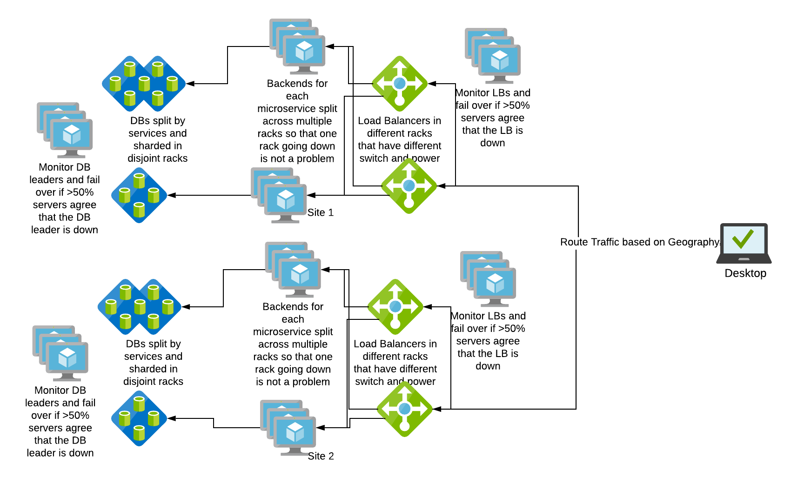

# HA - Availability - Common “Nines”
Availability is generally expressed as “Nines”, common ‘Nines’  are listed below.

| Availability %                  | Downtime per year |  Downtime per month | Downtime per week | Downtime per day |
|---------------------------------|:-----------------:|:-------------------:|:-----------------:|:----------------:|
| 99%(Two Nines)                  |  3.65 days        |    7.31 hours       |  1.68 hours       |  14.40 minutes   | 
| 99.5%(Two and a half Nines)     |  1.83 days        |    3.65 hours       | 50.40 minutes     |   7.20 minutes   |
| 99.9%(Three Nines)              |  8.77 hours       |   43.83 minutes     | 10.08 minutes     |   1.44 minutes   |
| 99.95%(Three and a half Nines)  |  4.38 hours       |   21.92 minutes     |  5.04 minutes     |  43.20 seconds   |
| 99.99%(Four Nines)              | 52.60 minutes     |    4.38 minutes     |  1.01 minutes     |   8.64 seconds   |
| 99.995%(Four and a half Nines)  | 26.30 minutes     |    2.19 minutes     | 30.24 seconds     |   4.32 seconds   |
| 99.999%(Five Nines)             |  5.26 minutes     |   26.30 seconds     |  6.05 seconds     |  864.0 ms        |

### Refer
- https://en.wikipedia.org/wiki/High_availability#Percentage_calculation

## HA - Availability Serial Components

A System with components is operating in the series If failure of a part leads to the combination becoming inoperable.

For example if LB in our architecture fails, all access to app tiers will fail. LB and app tiers are connected serially.

The combined availability of the system is the product of individual components availability

*A = Ax x Ay x …..*

### Refer
- http://www.eventhelix.com/RealtimeMantra/FaultHandling/system_reliability_availability.htm

## HA - Availability Parallel Components

A System with components is operating in parallel If failure of a part leads to the other part taking over the operations of the failed part.

If we have more than one LB and if rest of the LBs can take over the traffic during one LB failure then LBs are operating in parallel

The combined availability of the system is 

*A = 1 - ( (1-Ax) x (1-Ax) x ….. )*

### Refer
- http://www.eventhelix.com/RealtimeMantra/FaultHandling/system_reliability_availability.htm

## HA - Core Principles

**Elimination of single points of failure (SPOF)** This means adding redundancy to the system so that the failure of a component does not mean failure of the entire system.

**Reliable crossover** In redundant systems, the crossover point itself tends to become a single point of failure. Reliable systems must provide for reliable crossover.

**Detection of failures as they occur** If the two principles above are observed, then a user may never see a failure 

### Refer
- https://en.wikipedia.org/wiki/High_availability#Principles

## HA - SPOF

**WHAT:** Never implement and always eliminate single points of failure.

**WHEN TO USE:** During architecture reviews and new designs.

**HOW TO USE:** Identify single instances on architectural diagrams. Strive for active/active configurations. At the very least we should have a standby to take control when active instances fail.

**WHY:** Maximize availability through multiple instances.

**KEY TAKEAWAYS:** Strive for active/active rather than active/passive solutions. Use load balancers to balance traffic across instances of a service. Use control services with active/passive instances for patterns that require singletons.

## HA - Reliable Crossover

**WHAT:** Ensure when system components failover they do so reliably.

**WHEN TO USE:** During architecture reviews, failure modeling, and designs.

**HOW TO USE:** Identify how available a system is during the crossover and ensure it is within acceptable limits. 

**WHY:** Maximize availability and ensure data handling semantics are preserved.  

**KEY TAKEAWAYS:** Strive for active/active rather than active/passive solutions, they have a lesser risk of cross over being unreliable. Use LB and right load balancing methods to ensure reliable failover. Model and build your data systems to ensure data is correctly handled when crossover happens. Generally DB systems follow active/passive semantics for writes. Masters accept writes and when master goes down, follower is promoted to master(active from being passive) to accept writes. We have to be careful here that the cutover never introduces more than one masters. This problem is called a split brain.

## SRE Use cases
1. SRE works on deciding an acceptable SLA and make sure system is available to achieve the SLA
2. SRE is involved in architecture design right from building the data center to make sure site is not affected by network switch, hardware, power or software failures
3. SRE also run mock drills of failures to see how the system behaves in uncharted territory and comes up with a plan to improve availability if there are misses. 
https://engineering.linkedin.com/blog/2017/11/resilience-engineering-at-linkedin-with-project-waterbear

Post our understanding about HA, our architecture diagram looks something like this below

